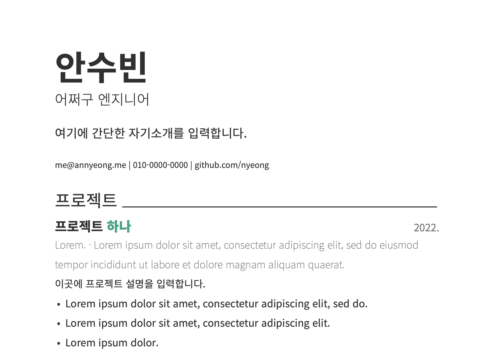

# resume

My resume template. Written with [Typst][typst].



[typst]: https://github.com/typst/typst
[typst-install]: https://github.com/typst/typst#installation

## Usage

1. Install [typst][typst-install].
1. Set font and primary color on `template.typ`.
1. Write a resume based on `resume.example.typ`.
1. Compile `.typ` into `.pdf` using `typst`.

### Set font and primary color

Edit `color` and `font` in `template.typ` file.
You can get a list of available fonts with the `typst fonts` command.

- [color](https://typst.app/docs/reference/types/color/)
- [rgb](https://typst.app/docs/reference/types/color/)

```typst
#let color = (
  black: rgb("#333"),
  gray: rgb("#777"),
  primary: rgb(16,163,127),
)

#let font = (
  base: "Noto Sans CJK KR"
)
```

### Write a resume

Import template with following code:

```typst
#import "template.typ": *

#show: resume.with(
  title: "resume",
  author: (
    name: " ",
    role: " ",
    introduction: [ ],
    info: [ ]
  ),
)
```

See the [docs](https://typst.app/docs) for the syntax.

### Compile into pdf

You can run a daemon with command `watch` to recompile whenever the file change.

```bash
$ typst compile resume.typ
$ typst watch resume.typ
```
